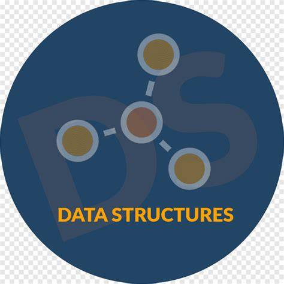

#Estructura De Datos

En este repositorio podras encontrar temas relacionadas con estructuras de datos  implementadas en JAVA como:

1. Tipos de Datos Abstractos
2. Recuirsividad
3. Arreglos
4. Genericos
5. Listas
6. Pilas 
7. Colas 
8. Metodos de Ordenamiento Y Busqueda
9. Arboles

 